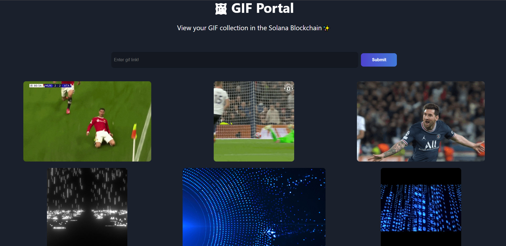

# SolGifs

• Developed a decentralized application(dApp) using Solana blockchain, Anchor framework, Rust, and React.
• Utilized Anchor and Rust to write and deploy smart contracts that enable users to upload and store their GIFs on the
Solana blockchain, ensuring data security and immutability.
• Integrated with Phantom wallet to allow users to connect their Solana wallet seamlessly and access their GIFs securely.

Go to frontend folder

```
npm install
npm run start
```


